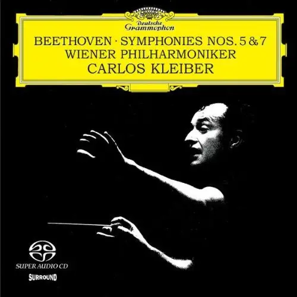
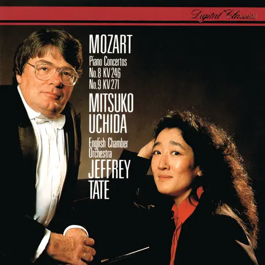
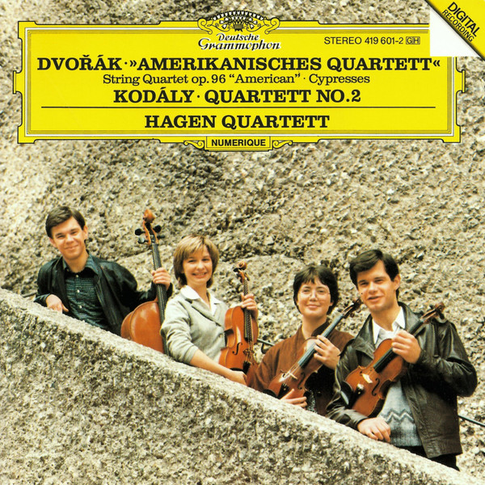
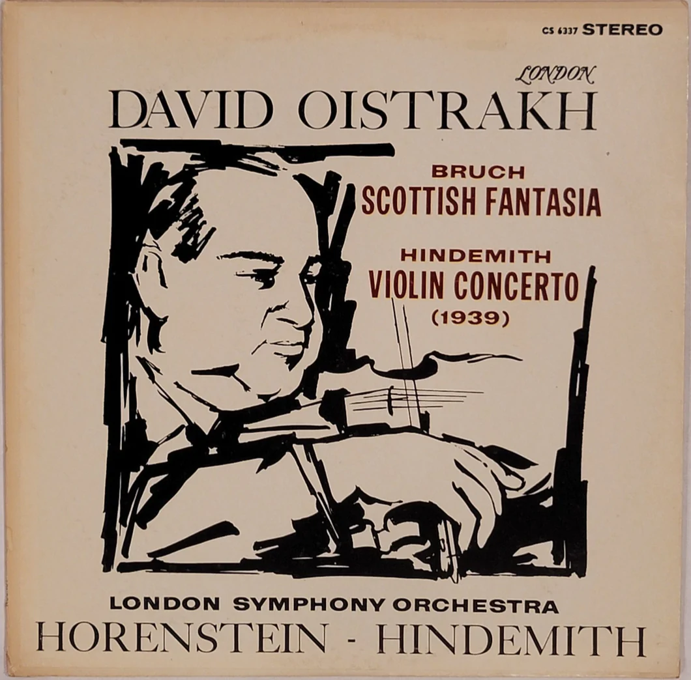

# 我的CD库

## 目录

## 古典

### 贝多芬 Beethoven

#### 第5,7交响曲

历史上只有一张唱片同时登上企鹅三星带花、日本唱片艺术名曲三百、《留声机》百大、DG 100（英国的Gramophone杂志为纪念Deutsche Grammophon的百岁生日，特别评选出的榜单，名为「DG百年历史最伟大的百张唱片」），Classic CD百大（由台湾著名古典音乐杂志《CD Hi》推出）五份权威榜单！这张唱片就是由卡洛斯克莱伯指挥维也纳爱乐乐团录制的贝多芬第五交响曲、第七交响曲。
　　当录音技术发展到本世纪中期以后，在那么多伟大指挥家都一再与一流乐团录过贝多芬的交响曲之后，几乎没有人相信还有谁能在这些音乐中找出更多令人振奋的新素材，可是一九七五年，克莱巴的第五、七号交响曲录音出现了，这是一份真正伟大的录音！这张是唱片史上不朽的经典之作，是经典中的经典。
　　如果你的唱片架只允许一张唱片，那么留下的一定是这一张！

### 莫扎特

#### 钢琴协奏曲

##### 内田光子

内田光子，出生于日本的钢琴家。演奏风格着重表达内心而非炫人的技巧。她以诠释莫扎特闻名，是被公认的“莫扎特专家”。从80年开始，日本钢琴家内田光子灌录的莫扎特钢琴奏鸣曲集便受到相当高度的瞩目，并且屡次赢得多项专业唱片评鉴的肯定。

##### No.8 No.9

德压满银圈 89

### 德沃夏克 DVORAK

#### 哈根四重奏 Hagen Quartett

　哈根四重奏成立于1981年，是由出生在奥地利萨尔茨堡音乐世家的哈根三兄妹和小提琴手Annette Bik组建的，1987年德国小提琴家Rainer Schmidt替换了Annette Bik，一直延续至今。

### String Quartet Op. 96 "American"

德沃夏克《美国四重奏》 / 科达伊《第二弦乐四重奏》

Dvořák: String Quartet No. 12 in F major, Op. 96 'American'
Kodály: String Quartet No. 2, Op. 10
Dvořák: Cypresses for string quartet, B152

《美国四重奏》是德沃夏克写完《第九交响曲》之后写的一部重要作品。在十九世纪，欧洲作曲家到了美国，远离了深深挚爱的欧陆故土和亲人，生活在物质发达、繁忙纷乱、拜金主义的美国社会，内心深处常常出现的是怀念亲人、想念故乡风土人情的感情。这种感情驱使德沃夏克写下了不朽的《第九交响曲》，也写下了伟大的《美国四重奏》。1893年，在纽约担任音乐学院院长的德沃夏克来到衣阿华州的一个捷克人移民社区度假。熟悉的家乡语言、家乡风物和家乡生活，加上美国大平原一望无际的美景，使作曲家“诗兴”（创作欲）大发，只花了3天时间就写下这部不朽的名曲。作品运用了一些印第安人民歌的因素，故称为《美国四重奏》。第一乐章反映了作曲家当时的愉快心情，淳朴而动人。最感人肺腑的是第二乐章，它的主题是感伤的，极为优美！它表达的是对故乡的深深怀念。我每次听到其中以小提琴与大提琴的对话演奏出来的主题，几乎都要落泪！第三乐章是谐謔曲，其中可以听到鸟儿的歌唱，间或复现思念家乡的感情。音乐的魅力就在于它通向人的感情深处，因而可以引起共鸣。任何热爱祖国、怀念故乡亲人和风物的人，都可以从这部四重奏中得到心灵的慰藉和感情的升华。

### Rruch

#### David Oistrakh

大卫·奥依斯特拉赫（Dawei Aoyisitelahe David Feodorovich Oistrakh , 1908—1974），俄国小提琴家。

1935年在华沙获维尼亚夫斯基国际小提琴比赛一等奖。

27岁到土耳其、波、英、瑞典等数十个国家巡回演出。接连在全苏、全乌克兰、维尼亚夫斯基国际小提琴比赛和依萨伊国际小提琴比赛获一等奖和冠军等，被誉为“莫斯科的帕格尼尼”。

1953年获苏联人民艺术家称号。

#### Scottish Fantasia

开盘带刻录CD

《苏格兰幻想曲》是德国著名的浪漫派作曲家布鲁赫（Bruch）的不朽之作。它不像一般德奥作品的艰深严肃，反之还处处洋溢着梦幻般的迷朦与凄美。如果你有一个感性浪漫的灵魂，相信你一定会深深地爱上这首小提琴曲。

《苏格兰幻想曲》是由一个引子和四个乐章所组成，每一个乐章都采用一首苏格兰民歌作为主题，旋律平易近人，非常好听。四个乐章所采用的民歌分别为凄美的《老罗宾. 莫里斯》、诙谐的《嘿，浑身尘土的磨房主》、哀怨的《我为失去了乔尼而优伤》及古老的苏格兰战歌《胜利的苏格兰人》。

这首小提琴曲的新录音虽然不少，但我要介绍的却是一个四十四年前（一九六二年九月十三及十四日）的早录音（唱片编号Lim XR24 015），演奏者是俄罗斯小提琴大师David Oistrakh，负责伴奏的是伦敦交响乐团，指挥为Jascha Horenstein。

听惯一般年轻小提琴家艳丽的音色后，回头再听David Oistrakh演奏，你将发现他的音色端庄质朴、真情流露，没有虚浮与媚俗；他的琴声温暖浑厚而又不失纤细，演奏丝丝入扣。在第一乐章里，除了如泣如诉的独奏小提琴之外，装上了弱音器的伴奏弦乐，音色如幻如梦，凄美迷朦得令人心碎！

《苏格兰幻想曲》除了演奏精彩之外，录音更是可圈可点，原来它出自Kenneth Wilkinson的手笔！发烧友也许不认识布鲁赫，但不可能不知道大名鼎鼎的录音师Kenneth Wilkinson。他的录音都展现出一贯宽阔的舞台及空间感，在一套调校得宜的系统上，你将发现音场的深度及阔度破墙而出，非常惊人！此外，他的录音都具有堂皇的音色，乐器间的空气感气息流动，定位历历在目，低频雄浑低潜，富有弹性！

《苏格兰幻想曲》是美国制作公司FIM向英国Decca取得母带后，以XRCD 24bit Super Analog的方式处理，并压制成XRCD。在我的书房里，以Sun Audio SV-2A3配搭Pioneer威士忌喇叭，宽阔深遂的音场超越了我的斗室，最教我惊讶的莫过于雄浑舒展的低音提琴音响，居然出现在威士忌喇叭上！虽然Lim以XRCD的最高规格来处理《苏格兰幻想曲》，但小提琴组在演奏强音时，音色仍嫌尖锐，摆脱不了CD神经兮兮的音色。

最近几年，古典音乐唱片市场严重不景气，再加上叱咤风云的大师相继作古之后，乐坛及录音界人才凋零，青黄不接的局面令人不胜唏嘘！随着《苏格兰幻想曲》CD的面世，人们得以重温上一世纪六十年代古典音乐与录音的黄金年代，多少风流人物，重登上疑幻疑真的音响舞台！

## 爵士

### Diana Krall

加拿大爵士乐钢琴手、歌手，以女低音闻名。

#### All For You

欧版 89

1995年，戴安娜·克瑞儿又转往Impulse!唱片公司，同年冬天，戴安娜·克瑞儿在这里发行了她的第三张个人专辑，向著名情歌歌王Nat "King" Cole三人组致敬的专辑《All for You》，这是戴安娜·克瑞儿首张引起轰动效应的唱片，同时也是戴安娜·克瑞儿首张以三人爵士演奏组合的形式录制唱片，其中吉他手是Russell Malone，贝斯手是Paul Keller，戴安娜·克瑞儿依然是钢琴和演唱。这张突破性的专辑在Billboard传统爵士排行榜上一直停留了长达70周的时间，并且成功的为戴安娜·克瑞儿赢得了第一次格莱美奖最佳爵士演唱歌手奖的提名。

#### The Look Of Love
美版 89

在成为了最受欢迎的女歌手之后，戴安娜·克瑞儿在获奖之后的新专辑、第六张个人专辑《The Look of Love》在2001年9月发行之后的首周就以9万5千张的成绩成为了Billboard 200排行榜的第九名，并且迅速的在全美销量超过白金，在加拿大的销量更是突破了惊人的五百万张，这是加拿大第一次有爵士乐音乐家做到如此高销量。除了在北美地区之外，戴安娜·克瑞儿的这张专辑依旧在全世界风靡，在澳大利亚，新西兰，波兰和葡萄牙，这张唱片的销量超过白金，还在法国、新加坡、以及英国销量达到了金唱盘销量。在随后一年的加拿大Juno奖颁奖典礼上，戴安娜·克瑞儿凭借这张专辑再次拿下了年度最佳歌手（Best Artist），年度最佳专辑（Best Album），以及年度最佳爵士演唱专辑（Best Vocal Jazz Album）三项大奖。

#### The Girl in the Other Room
英版 89

2004年4月27日，戴安娜·克瑞儿经过长时间精心的制作之后，发行了她的最新录音室专辑《The Girl in the Other Room》，并且在商业和评论上取得了更好的成绩。作为当代最受欢迎的爵士演唱女歌星，戴安娜·克瑞儿在商业上以及评论界多方面的成功仍然继续。
