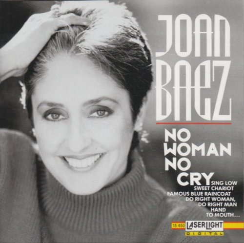

# 民谣CD

## 目录

<!-- @import "[TOC]" {cmd="toc" depthFrom=1 depthTo=6 orderedList=false} -->

<!-- code_chunk_output -->

- [民谣CD](#民谣cd)
- [目录](#目录)
- [Joan Baez](#joan-baez)
  - [No Woman No Cry](#no-woman-no-cry)
  - [The Best Of Joan Baez](#the-best-of-joan-baez)

<!-- /code_chunk_output -->

## Joan Baez

### No Woman No Cry

亚洲首版无码 99

1		No Woman No Cry
2		The Moon Is A Harsh Mistress
3		Carrickfergus
4		El Preso Numero Nueve
5		Famous Blue Raincoat
6		Do Right Woman, Do Right Man
7		Swing Low, Sweet Chariot
8		Hand To Mouth
9		No Nos Moveran
10		Rambler Gambler - Whispering Bells

### The Best Of Joan Baez

欧版 99

1	Children & All That Jazz
2	Diamonds & Rust
3	Forever Young
4	Gracias a la Vida (Here's to Life)
5	Imagine
6	Love Song to a Stranger
7	Never Dreamed You'd Leave in Summer
8	Please Come to Boston
9	Prison Trilogy
10	Simple Twist of Fate
11	Sweeter for Me
12	Night They Drove Old Dixie Down