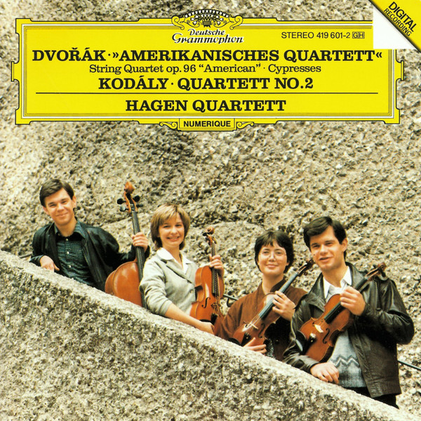

# 我的CD库

## 目录

## 古典

### 莫扎特

#### 钢琴协奏曲

##### 内田光子

内田光子，出生于日本的钢琴家。演奏风格着重表达内心而非炫人的技巧。她以诠释莫扎特闻名，是被公认的“莫扎特专家”。从80年开始，日本钢琴家内田光子灌录的莫扎特钢琴奏鸣曲集便受到相当高度的瞩目，并且屡次赢得多项专业唱片评鉴的肯定。

##### No.8 No.9

德压满银圈 89

### 德沃夏克 DVORAK

#### 哈根四重奏 Hagen Quartett

　哈根四重奏成立于1981年，是由出生在奥地利萨尔茨堡音乐世家的哈根三兄妹和小提琴手Annette Bik组建的，1987年德国小提琴家Rainer Schmidt替换了Annette Bik，一直延续至今。

### String Quartet Op. 96 "American"

德沃夏克《美国四重奏》 / 科达伊《第二弦乐四重奏》

Dvořák: String Quartet No. 12 in F major, Op. 96 'American'
Kodály: String Quartet No. 2, Op. 10
Dvořák: Cypresses for string quartet, B152

《美国四重奏》是德沃夏克写完《第九交响曲》之后写的一部重要作品。在十九世纪，欧洲作曲家到了美国，远离了深深挚爱的欧陆故土和亲人，生活在物质发达、繁忙纷乱、拜金主义的美国社会，内心深处常常出现的是怀念亲人、想念故乡风土人情的感情。这种感情驱使德沃夏克写下了不朽的《第九交响曲》，也写下了伟大的《美国四重奏》。1893年，在纽约担任音乐学院院长的德沃夏克来到衣阿华州的一个捷克人移民社区度假。熟悉的家乡语言、家乡风物和家乡生活，加上美国大平原一望无际的美景，使作曲家“诗兴”（创作欲）大发，只花了3天时间就写下这部不朽的名曲。作品运用了一些印第安人民歌的因素，故称为《美国四重奏》。第一乐章反映了作曲家当时的愉快心情，淳朴而动人。最感人肺腑的是第二乐章，它的主题是感伤的，极为优美！它表达的是对故乡的深深怀念。我每次听到其中以小提琴与大提琴的对话演奏出来的主题，几乎都要落泪！第三乐章是谐謔曲，其中可以听到鸟儿的歌唱，间或复现思念家乡的感情。音乐的魅力就在于它通向人的感情深处，因而可以引起共鸣。任何热爱祖国、怀念故乡亲人和风物的人，都可以从这部四重奏中得到心灵的慰藉和感情的升华。

## 爵士

### Diana Krall

加拿大爵士乐钢琴手、歌手，以女低音闻名。

#### All For You

欧版 89

1995年，戴安娜·克瑞儿又转往Impulse!唱片公司，同年冬天，戴安娜·克瑞儿在这里发行了她的第三张个人专辑，向著名情歌歌王Nat "King" Cole三人组致敬的专辑《All for You》，这是戴安娜·克瑞儿首张引起轰动效应的唱片，同时也是戴安娜·克瑞儿首张以三人爵士演奏组合的形式录制唱片，其中吉他手是Russell Malone，贝斯手是Paul Keller，戴安娜·克瑞儿依然是钢琴和演唱。这张突破性的专辑在Billboard传统爵士排行榜上一直停留了长达70周的时间，并且成功的为戴安娜·克瑞儿赢得了第一次格莱美奖最佳爵士演唱歌手奖的提名。

#### The Look Of Love
美版 89

在成为了最受欢迎的女歌手之后，戴安娜·克瑞儿在获奖之后的新专辑、第六张个人专辑《The Look of Love》在2001年9月发行之后的首周就以9万5千张的成绩成为了Billboard 200排行榜的第九名，并且迅速的在全美销量超过白金，在加拿大的销量更是突破了惊人的五百万张，这是加拿大第一次有爵士乐音乐家做到如此高销量。除了在北美地区之外，戴安娜·克瑞儿的这张专辑依旧在全世界风靡，在澳大利亚，新西兰，波兰和葡萄牙，这张唱片的销量超过白金，还在法国、新加坡、以及英国销量达到了金唱盘销量。在随后一年的加拿大Juno奖颁奖典礼上，戴安娜·克瑞儿凭借这张专辑再次拿下了年度最佳歌手（Best Artist），年度最佳专辑（Best Album），以及年度最佳爵士演唱专辑（Best Vocal Jazz Album）三项大奖。

#### The Girl in the Other Room
英版 89

2004年4月27日，戴安娜·克瑞儿经过长时间精心的制作之后，发行了她的最新录音室专辑《The Girl in the Other Room》，并且在商业和评论上取得了更好的成绩。作为当代最受欢迎的爵士演唱女歌星，戴安娜·克瑞儿在商业上以及评论界多方面的成功仍然继续。