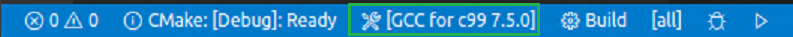

<!-- @import "[TOC]" {cmd="toc" depthFrom=1 depthTo=6 orderedList=false} -->

<!-- code_chunk_output -->

- [和VSCode集成](#和vscode集成)
  - [Linux开发工具安装](#linux开发工具安装)
  - [VSCode插件](#vscode插件)
  - [建立一个project](#建立一个project)

<!-- /code_chunk_output -->

# 和VSCode集成

## Linux开发工具安装

需要预先在Linux上安装build-essential, gdb, cmake

## VSCode插件

1. C++ extension for VS Code.
2. CMake Tools extension for VS Code. 

## 建立一个project

1. project根目录下有一个CMakeLists.txt文件
2. 选择编译器，可以在下面的Status Bar选择(GCC,clang)，也可以通过Ctrl+Shift+P打开命令，执行CMake: Select a Kit.
3. 选择版本：可以在项目的Status Bar选择（Debug, Release...)，也可以通过Ctrl+Shift+P打开命令，执行CMake: Select Variant
4. 编写好CMakeLists.txt和代码后，可以也可以通过Ctrl+Shift+P打开命令，执行CMake: Configure来执行配置，在build目录下生成配置文件。相当于在build目录下执行cmake ..
5. 编译链接：可以在下面的Status Bar选择点击Build按钮（build目标在Build按钮选择，Build目标在CMakeLists.txt文件中定义）。相当于在build目录下执行cmake --build .
6. 点击Status Bar的运行（三角形状）或调试（瓢虫形状）按钮进行运行或调试。

cmake status bar:

