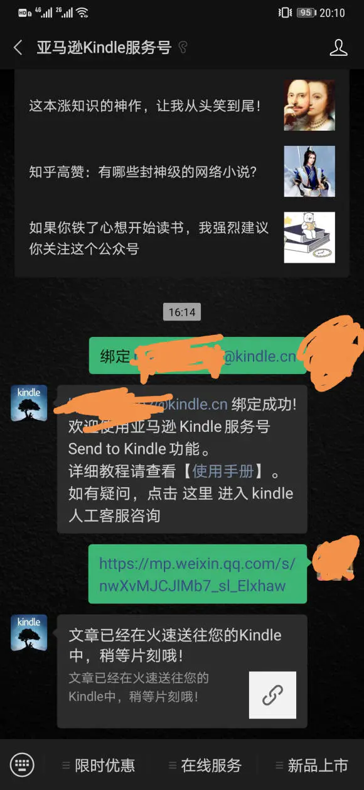
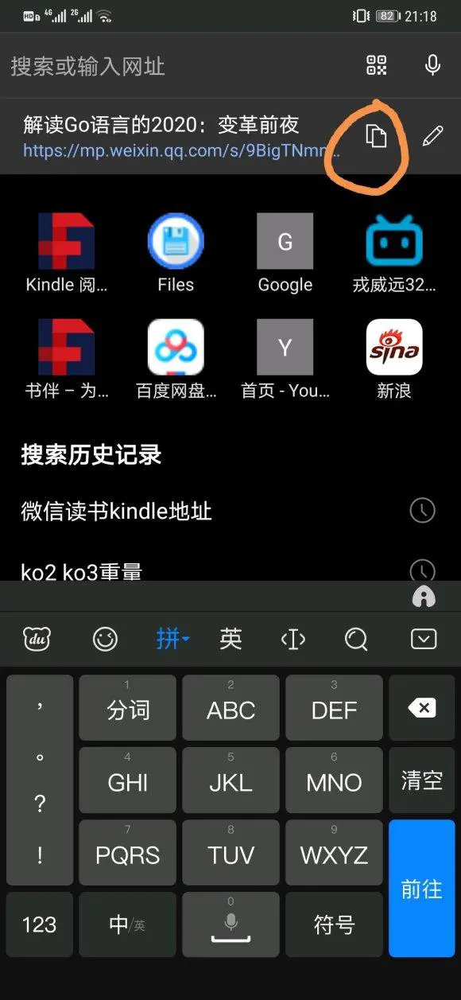
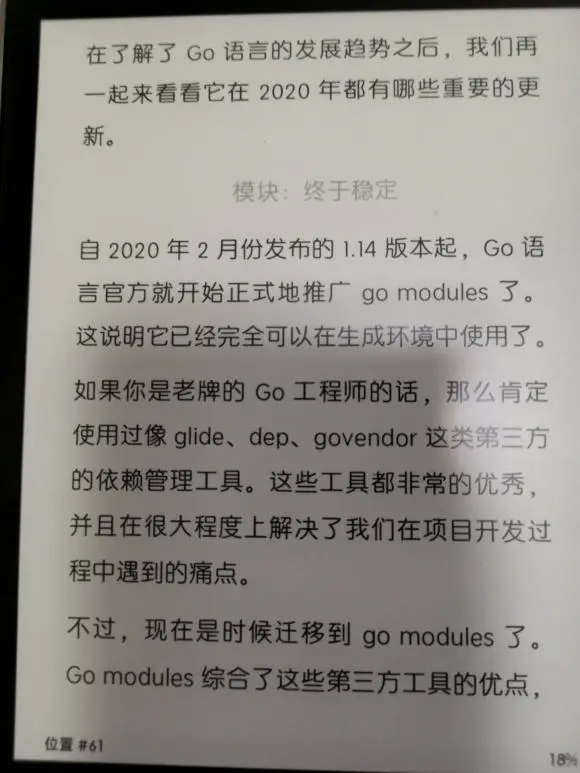
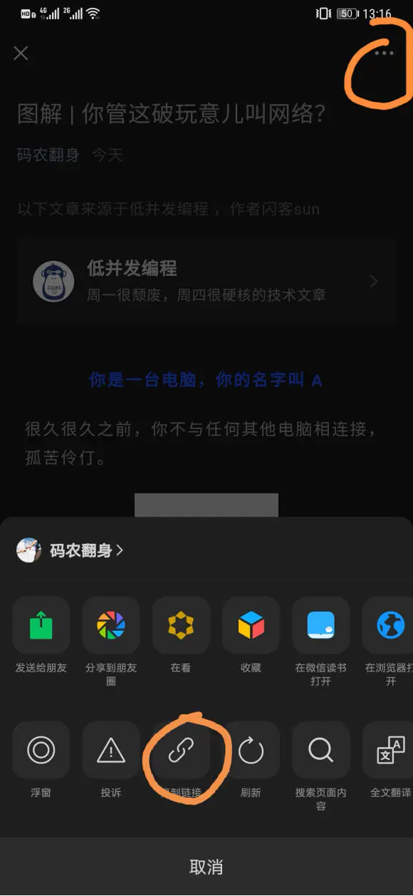
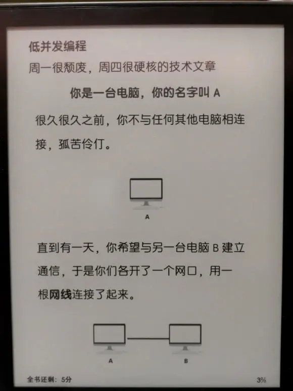
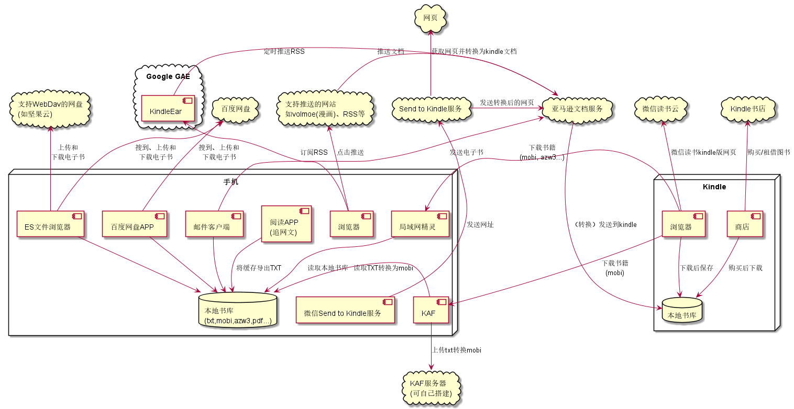

# Kindle看书的正确态度

kindle看书的效果在电纸书中是比较好的，kindle的书库也比较齐全，排版也还可以，各种功能也还行（字典，X-Ray，各种字体排版调整）。买一个性价比不错的Kindle（如当前的KPW4，700多块32G版本）看书是比较惬意的事情。

kindle看书的效果在电纸书中是比较好的，kindle的书库也比较齐全，排版也还可以，各种功能也还行（字典，X-Ray，各种字体排版调整）。买一个性价比不错的Kindle（如当前的KPW4，700多块32G版本）看书是比较惬意的事情。

同时好的书作者有了收益，才能激励更好的书的产出。

# 省钱

看正版并不意味着我们不能合理省钱，收入不高，有省钱爱好等都是理由。但是省钱并不意味着要亲近盗版。

# Kindle之外的书库

Kindle书库中无法包罗万象，所以确实还需要外部的书库进行补充。

# 如何看待开放系统电纸书

如果仅以省钱和获取Kindle书库外的数据的角度来看，开放系统似乎是更好的选择，但是很多开发系统的电纸书的阅读效果并不如Kindle，且因为大量的软件会分散阅读的注意力，削弱了本身阅读的目的。

# Kindle Unlimited

Kindle Unlimited应该是省钱的好方法。首先Kindle Unlimited先包两年也只要160块，一年才80块。可以同时免费借阅10本书。一般人也不会同时阅读超过10本书。涵盖的范围也不错，很多热门书籍都包含在里面。缺点是部分领域包含得比较少，例如计算机，科技领域的。Kindle Unlimited也经常打折，尤其是过年或各种购物节，记得注意一下。我来记得有一次就是128元包两年。

# 微信读书网页版

Kindle本身有浏览器，而微信读书网页版算是最有良心的，对电纸书支持得算非常不错的。在Kindle的浏览器中输入网址：https://weread.qq.com/，通过手机微信扫码就可以登录并进入书架。然后将书架的地址保存到书签，后续即可方便的通过书签打开。

为什么推荐微信读书网页版的。因为目前微信读书正在大力推广，所以组建一个有大量用户的微信群（或者在淘宝上花2块多钱加入一个），然后通过组队读书，读书时长，抽奖，翻一翻，联名卡，挑战问答等多种方法获取无限卡。微信读书的无限卡几乎是可以看所有书的。目前获取无限卡的速度是远远超过你使用的速度的。我操作6天，几乎没怎么花时间（每天<5分钟），获得了70天的无限卡。

同时微信读书时唯一一个提供了适合电纸书阅读的网页效果的。使用Kindle，基本能获得非常不错的体验。

当然微信读书也有一些弱点，不知道微信读书后续是否会改进：

1. 只能看书架的书，找书加书架等操作在手机上完成，阅读时用kindle打开书架的书阅读即可。

2. 只能看书，不能看微信读书的公众号和收藏的文章。

3. 书的字体有点小（但我感觉还可以接受）。

4. 不支持字典查找，划线等功能。

5. 中英文混排偶尔会有英文错位的问题（不多），长图偶尔会显示不出来。

6. 图片不能缩放

但总体说，微信读书的正版书获取代价比较低，在Kindle只做阅读，效果还是不错的。

# 下载图书传到Kindle上

对于Kindle书库或者微信读书里面没有的图书，可以考虑用手机（或者电脑）下载并传到Kindle上。有如下几种方法

## 通过邮箱发送
你的kindle在注册的时候会给你分配一个唯一的邮箱。这个可以在你的kindle设置里面可以看到，也可以登录亚马逊网站，在“管理我的内容和设备“的设备列表中，找到你的kindle，然后查看。同时在“管理我的内容和设备”中可以修改这个分配给你的邮箱地址。

然后你可以通过电子邮件，将电子书作为附件发送到为你的kindle分配的邮箱。注意你用来发送电子书的邮箱需要在“管理我的内容和设备“中“个人文档设置”里面添加到“已认可的发件人电子邮箱列表”中才能发送。

发送文档支持txt，mobi，prc，azw，pdf等格式（但是不支持最新的azw3格式，这个有些郁闷，因为限制很多书下载的时候都提供了azw3的格式）。

书大小限制在50M，如果超过50M可以压缩成zip文件再发送。传送到你的kindle时是解压过后的。

发送的文档可以要求亚马逊将电子书转换为kindle的格式。只需要在主题中填写"Convert"就可以了。不过这样要多等一段时间。

使用转换功能，可以看epub电子书，例如将epub文件的后缀改为html，然后发送给亚马逊邮箱，标题加上Convert。

通过邮箱发送存在少数情况收不到，或者受到延迟较大的情况。

## 通过OTG线传送

前提是你的手机支持OTG功能。一般现在中高端手机，甚至一些低端手机都支持OTG能力。购买一根OTG线连接手机和kindle。如果你的手机是TYPE-C接口，你就要买一头是TYPE-C，一头是Micro-USB的线（现在kindle一般都是Micro-USB的接口）。

在手机的文件管理器将图书拷贝到Kindle的Documents目录下就可以了。

至于书籍在手机上可以有各种方法下载，可以通过网页下载，例如：https://sobooks.cc/就有很多书可以下载。可以通过网盘下载（把自己的书保存在网盘）

通过OTG线的方法是最快的，而且也支持azw3格式。但是你出门需要携带一根线。不方便且容易搞丢

## 通过手机热点传书

针对OTG线的不方便，可以有另外一种方法。我们知道Kindle浏览器可以下载图书，但是搜书不方便，对网盘支持也差。

所以我们在手机上安装一个局域网精灵，可以提供一个简单的web服务器下载分享的电子书。

首先手机开热点，然后kindle连接到这个手机开的热点，两者现在处于同一个局域网下。

然后我们可以在手机上下好书，再打开局域网精灵将这些下好的书设置分享，同时局域网精灵会给出一个地址。

然后再kindle浏览器中输入这个地址，这时候就会打开一个网页，里面有手机通过局域网精灵分享的图书，点击右边的download下载即可。

这个方法使用上比OTG线稍微麻烦一点，但是好处是不需要一根额外的线。同时也支持azw3格式。

# 获取图书的方法

1. 从一些网站获取。例如https://sobooks.cc/

2. 从贴吧里获取。例如kindle吧，azw3吧。

3. 手机上有一个叫“开源阅读”的软件，你可以将搜到的书缓存下来，然后通过一个叫“缓存提取”的工具将书转换为TXT文件。

4. Z-Library给你一个新世界

# TXT文件转换

kindle看TXT文件有个问题就是不能自动提取目录。可以通过其他工具将TXT转换为mobi和azw3格式的文件并提取目录。

我一直用的转换软件是calibre。

手机上可以使用kaf应用。这个应用需要一个服务器来执行文档转换，服务器可以使用默认的（大家要一起抢资源），也可以自己搭建一个，具体可以参考https://github.com/ystyle/kas。里面也附了手机的kaf app下载。

我用家里的x86群晖NAS搭建了一个自己专用，x86群晖支持docker，服务器提供了docker镜像，搭建非常容易。

# 如何看网络长文

手持Kindle，对于文字较多，需要长时间认真阅读的长文(包括头条，网页，微信公众号文章等)，如果能在Kindle上阅读，应该是比较惬意的事情。

奈何Kindle不是开放系统，Kindle的浏览器也就是个试验品，无法满足上述要求。

通过亚马逊官方的Send to Kindle服务，可以比较好的实现这点。

首先你要关注亚马逊Kindle公众号，并在公众号里面绑定你的Kindle邮箱。

建议将公众号添加你桌面首页，后续比较好进入

以开发者头条为例，我们看中一篇长文，想要送到kindle上阅读，选择用浏览器打开(其实很多软件的分享里面有拷贝连接地址的选项，就不用使用浏览器打开了，技术头条没有这个选择，只好借助浏览器)，然后在浏览器中拷贝地址，最后到桌面打开亚马逊公众号发送地址就可以了。

今日头条，知乎等都有拷贝链接，这样只要打开公众号发送即可，只需两步。

在kindle上看还是比较舒服的。

另外有一个需要注意的事情，看Send to Kindle发送的文档，目前只能用kindle自带的字体，用自定义字体打开文档直接就出错，然后其他书也打不开了。需要重启kindle.

微信公众号长文发送kindle更容易，打开文章，选择左上角"…"，然后选择复制链接，然后在亚马逊公众号发送即可。kindle看，效果棒棒的。 不过kindle不支持动图。

# 如何看RSS

这个请参考[KindleEar 搭建教程：推送 RSS 订阅到 Kindle](https://bookfere.com/post/19.html)

能合理上网，按照教程比较容易实现。只支持使用GAE，其实我是很希望支持docker镜像的，这样我就可以在自己的NAS服务器上部署。

# Z-Library

诟病Kindle，掌阅，remarkable等不开放电纸书，容易吃灰

问题包括：
1. 单一的书城不全
2. 喜欢微信能这种能阅读到很多免费的书
3. 自己找书的话不太方便，也有些麻烦。

如果大家了解到Z-Library，你会进入一个新的世界。这里：
1. 你可以找到大部分电子书，都是免费的。 正规出版书籍，需要的专业书籍，漫画，精排的完本小说，爱情动作小说等，无一不包。
2. 你可以收藏整理书籍，标签分类方便，也可以上载你的书分享。
3. 根据你收藏的书籍，Z-Library可以给你推荐书籍，算法非常好，远比亚马逊书城，京东书城什么的好。

虽然不像微信读书那么方便，但是依然比较好，以kindle为例，搜索到电子书后：
1. 对于小于某个容量的书（我估摸是20M），找到后可以直接推送给Kindle，如果是Kindle不支持的格式，可以帮你直接转换成mobi格式（这个功能需要捐献少量的钱，支付宝可以方便支付）。
2. 如果你手边有电脑，直接下载，然后穿到Kindle上的Documents目录。
3. 如果你有手机，装个局域网传文件的软件，如安卓手机的”局域网精灵“，用手机下载后通过软件分享。然后用Kindle的浏览器直接连接手机下载。（建议通过连接手机的热点下载，因为手机热点下，手机的ip始终是192.168.43.1，Kindle就可以保存书签，然后打开，不用每次输入。而且Kindle浏览器启动时会打开上次的页面，连书签的不用选）

其他的非开放电子书都类似，只是不能用方法1，通过邮件推送（这个只有kindle提供了服务）。

对于一些配置低的开放电子书，这类电子书一般都有一个效果不错，支持多种格式的自带的阅读软件。但是因为配置低，安装各种阅读软件耗电，且体验不好。通过Z-Library的书源加上手机自带的阅读软件，就可以达到很好的阅读体验。然后再安装一个微信读书就好，追网文安装一个开源阅读。 几百块的博阅P6这种显示效果好的低配电纸书配合Z-Library也很好。

我的ko2+Z-Library就满足了阅读体验，有丰富的书源，免费，下书传书方便，ko2的阅读效果好，轻（阅读的时候把书套摘下来），有翻页按钮，重力感应可以左右手轮流换持，背光不错且能支持自动调光。阅读了很多书籍。

不过不适合追网文（看网文没问题，我也喜欢看完本经典，而且完本的再Z-Library上有大量azw3，epub等精排的书，也避开了kindle阅读txt无法分章节的问题），也不适合喜欢拿电纸书刷今日头条，公众号，贴吧等用户人群。

# 手机配合Kindle全景图

