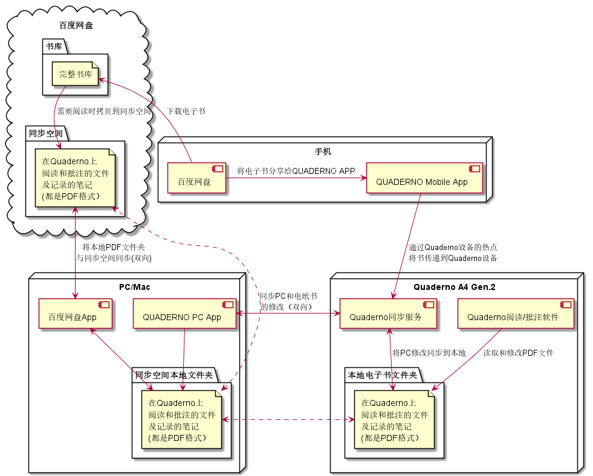

# Quaderno A4 Gen.2 使用经验

## 目录

<!-- @import "[TOC]" {cmd="toc" depthFrom=1 depthTo=6 orderedList=false} -->

<!-- code_chunk_output -->

- [Quaderno A4 Gen.2 使用经验](#quaderno-a4-gen2-使用经验)
  - [目录](#目录)
  - [文件同步流程](#文件同步流程)

<!-- /code_chunk_output -->

## 文件同步流程

我使用Quaderno A4 Gen.2的自动化同步流程

同步设定：
1. 在我的PC/Mac上安装百度网盘APP，并打开同步空间，映射同步空间在PC/Mac上的本地文件夹
2. 在我的PC/Mac电脑上安装Quaderno APP，并配置与Quaderno A4 Gen.2的同步。
3. 在首次同步后在Quaderno APP中将Quaderno的目录和同步空间的本地文件夹绑定

后续同步流程：
1. 将Quaderno A4 Gen.2和PC/Mac通过无线和有线连接后发起同步
2. 同步完成后，将Quaderno A4 Gen.2上的所有PDF文件（包括书，批注，笔记）和PC/Mac上的同步空间文件夹同步。
3. 百度网盘应用将同步空间本机文件夹和百度云上的同步空间进行同步。

给Quaderno添加电子书的方法：
方法一：通过手机添加
1. 通过手机的百度网盘APP下载百度网盘上的书库，并分享给QUADERNO Mobile App
2. 通过分享打开QUADERNO Mobile App后，通过有NFC功能的手机触碰Quaderno的NFC，可以打开Quaderno的WiFi热点，App会自动将手机的WiFi与热点连接。
3. 点击传输到Quaderno，就可以选择文件夹，并将文件传输到Quaderno
4. 下次Quaderno和PC/Mac同步时会自动同步新添加的电子书

方法二：通过网盘添加
1. 通过手机或者PC/Mac的百度网盘APP，将完整书库中的书拷贝到百度云的同步空间。
2. PC/Mac上的百度APP，会自动将同步空间的文件同步到对应的本地文件夹
3. 然后Quaderno和PC/Mac同步就会将书同步到Quaderno

看完的书和过期的笔记的处理方法：
1. 如果看完的书有批注且需要保存，或者过期的笔记需要保存，则将文件从百度云上的同步空间移到完整书库备份。
2. 此时PC/Mac的百度网盘APP会将同步空间的书和笔记删除。
3. 下次Quaderno和PC/Mac同步的时候会将Quaderno设备上对应的书和笔记删除。

