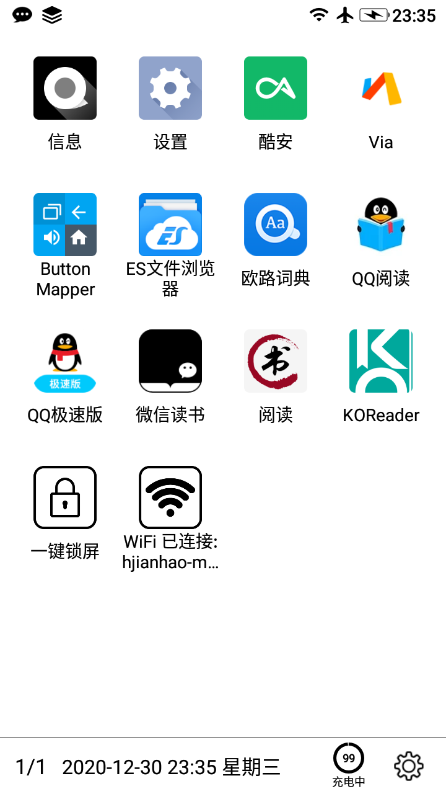

花300块打造一本相对满意的口袋书

<!-- @import "[TOC]" {cmd="toc" depthFrom=1 depthTo=6 orderedList=false} -->

<!-- code_chunk_output -->

- [口袋书的历史](#口袋书的历史)
- [数码时代的口袋书](#数码时代的口袋书)
- [口袋阅解决方案](#口袋阅解决方案)
  - [价格](#价格)
  - [重量](#重量)
  - [定制](#定制)
    - [刷精简ROM](#刷精简rom)
    - [删除ROM中不需要的软件](#删除rom中不需要的软件)
    - [安装软件](#安装软件)
- [软件选择](#软件选择)
  - [系统](#系统)
  - [应用市场](#应用市场)
  - [文件管理器](#文件管理器)
  - [看正版的出版读物](#看正版的出版读物)
  - [追网络小说](#追网络小说)
  - [看网上下载的电子书](#看网上下载的电子书)
  - [稍后读](#稍后读)
  - [看漫画](#看漫画)
  - [听书](#听书)
  - [字典](#字典)
  - [浏览器](#浏览器)
- [只做口袋阅读器该做得事。](#只做口袋阅读器该做得事)

<!-- /code_chunk_output -->

# 口袋书的历史

口袋书顾名思义就是可以放在口袋里的书籍，对口袋的标准书没有完全准确的界定，大抵是指开本小于小32开，印张大致不超过10个印张的书。口袋书的兴起，最早可以追溯到1935年7月在伦敦出版的“企鹅丛书”，这套丛书3年间销售2500多万册，获得巨大成功。口袋书从此流行于世并引发了一场“纸皮书革命”，对欧美国家的出版业产生了深远的影响，甚至与美国发明柯达克罗姆彩色胶片一起列入20世纪的人类发明、人类冒险和不寻常的事件当中。

口袋书流行的原因： 体积小，好携带，售价也低廉。

# 数码时代的口袋书

如今阅读也进入了数码时代，口袋书也被电子设备所代替，手机明显就是电子口袋书，但是手机的屏幕对阅读的眼睛疲劳可不是十分友好，E-INK屏幕设备因此而生。

在Kindle和各种国内安卓电纸书虽然流行，也满足了一大部分市场，但是6-13寸的屏幕，对比以前的书籍都不是口袋书的范围，对于一本E-INK口袋书，我觉得他应该有如下特点

1. 体积下，足够轻。这满足人们放在口袋里做碎片化时间阅读的需求。 因为E-INK设备当前无论如何不能作为主力手机使用，您已经携带了一台手机了，所以这个阅读器越轻越好。
2. 屏幕要能满足一定的阅读需求，首先显示效果要过得去，同时要有一定大小，至少得超过5寸。
3. 能满足用户的看书需求，简单说就是用户想要看的书你能让他看。
4. 相对便宜，在你附带了一个手机后，对大部分人来说这不应该再是一个比较昂贵的设备，毕竟你只是拿他来看书。

# 口袋阅解决方案

## 价格

闲鱼上你能在300左右淘到成色不错的二手的口袋阅1代，500多可以拿到一个口袋阅2代。

## 重量

作为口袋书，他真的足够轻，他基本舍去了看书外所有的功能，口袋阅1代只有120多克，2代130多克，别看只少了这么20-30克，但是拿在手里的手感完全不一样。

我更推荐1代，120多克，而且CPU性能也购，1+8的配置对于看书来说没有问题。

## 定制

为什么要定制？首先是因为他能定制，开个玩笑。原因如下：
1. 口袋阅1代的内存和存储比较小，去除不必要的内容，才能获得最大的资源存放电纸书和运行程序
2. 口袋阅的界面是定制的，操作习惯有点不舒服，要用的应用可能并不在第一屏
3. 口袋阅的系统安装软件比较麻烦

于是我们要做个定制，定制所需的ROM和工具我都在网盘上共享了。

链接：https://pan.baidu.com/s/1RJ9Vh5SVIThZ5lf-o_tIaw 
提取码：6lhf 

### 刷精简ROM

第一步先打开口袋阅的USB调试模式，每个版本不同，最新的V91版本是在电话拨号界面输入：“*#*#5858#*#*”打开开发者选项，然后在手机的设置里面将"USB调试”开关打开，并连接手机选择允许连接调试。

第二步在Windows电脑安装展讯的刷机工具
1. 首先从网盘上的“口袋阅刷机工具+驱动”目录下载“SPRD_NPI_USBDriver_1.4.rar”，解压并安装驱动
2. 下载展讯刷机工具”ResearchDownload_R23.19.3301.zip“，解压

第三步下载精简ROM，就是”SC801a.V88_Modify_Root.pac“这个文件

第四步运行解压的展讯刷机工具目录下的”ResearchDownload.exe“，点击第一个齿轮图标，加载第三步下载的ROM，然后点击第三个三角形的执行图标。

第五步将口袋阅关机，按住音量下键，并将口袋阅与电脑通过USB线连接，就开始刷机了，你可以先喝杯咖啡，看看书。等上一段时间看见状态显示Ready，就可以将USB线拔下来，口袋阅也在重启了。

### 删除ROM中不需要的软件

ROM虽然号称精简了，但是还是有很多app是不想要的，也有不少app是想安装的，一般来说可以通过豌豆荚，360手机助手这些工具安装和卸载app，但是这些工具一般都会在手机设备上安装一个助手app，而这个助手app就流氓了，各种推荐，弹窗，锁屏动画等，不一而足。有没有一个不需要在手机上安装应用，可以在windows安装和卸载手机应用的工具呢？

我网盘中共享了一个“TOOLS_BY_CZ_V7.20”就可以做到这点，下载后解压，执行“CZ's Utility Tools V7.20.exe”

下面是主界面：

连接口袋阅后（USB调试模式），点击“软件与传输”，打开如下界面

如果想卸载某个ROM自带APP，可以在口袋阅上打开这个APP，点击”显示当前界面活动“，然后会跳出一个命令行窗口，里面会显示当前的活动，而”/“符号前面的一截就是APP的包名，然后将包名拷贝到这个界面上方包名的输入框中，然后点击”卸载（S)",就会进行卸载。

对于这个ROM中的Root Explorer，口袋阅原来的应用商店，还有Magisk manager等我都是不需要的，删除之。这个根据个人需求。

### 安装软件

如果想安装某个APP，可以在网站上下好后，放入这个工具解压目录下的files文件夹，然后点击刷新就会出现在左下的对话框，然后点击要安装的软件就可以安装。

整个工具可以不用在口袋阅上安装任何APP。

具体安装什么软件根据个人需求，后面我会说一些我的选择

# 软件选择

先看一下我完成选择后的桌面，截图是彩色的，凑合着看。

## 系统
就用默认的E-Ink Launcher， 挺好用的，和普通安卓Launcher差不多，比原生的好用很多。
可以方便的隐藏应用，一些基本不用的图标都隐藏掉，包括讯飞，电话拨号之类的。

因为口袋阅下面的三个导航按键是按照原生Launcher设计的，和安卓标准的不一样，所以用ROM自带的Button mapper重新映射到主页，返回和最近应用。

Button Mapper申请的无障碍权限有时会因为进程被杀丢失，建议在最近应用中锁定Button Mapper。

## 应用市场

删除内置的应用市场， 安装酷安。这个自己选择，我选择酷安是因为一些软件例如“阅读”只能在酷安上更新。
你也可以安装应用宝之类的。

考虑到这只是个阅读器，不用于购物，记录私人信息等，所以应用市场的安全性并非那么重要，所以酷安也能接受。

## 文件管理器

理删除内置的Root Explorer和口袋阅助手

安装ES文件管理器，虽然ES文件管理器做到今天，广告多，也开始臃肿了，但是ES文件管理器是唯一满足我要求的。

1. 能连接WebDav（需要访问坚果云，本地NAS）
2. 能访问百度网盘（这个是唯一一个，因为不想装百度网盘客户端，那个太臃肿，太慢了）
3. 口袋阅能够通过FTP访问手机上启动的FTP服务器（手机上可以用ES浏览器启动FTP服务），用于口袋阅和手机交换文件。相反操作也可以。

尤其是上面的第二点，ES浏览器仗着是百度的亲儿子，这个是唯一的选择。

## 看正版的出版读物

微信读书墨水屏版，这是我的选择。 如果有在kindle、京东读书、当当、多看上买书的朋友，自己安装对应的客户端就好了，不过机器内存不大，不要求全，安装需要的，我的选择是微信读书。

## 追网络小说

安装“阅读” APP一个就足够了，关注他家公众号“开源阅读”获取书源，几乎能追所有小说。同时他支持百度的多种AI语音，在线朗读效果非常好。换字体，支持左边，右边点击都翻下一页（左右手换着拿很有用），支持调节各种显示参数，行距，段距，字体大小，加粗，有E-INK主题，可以通过WebDav同步（我用坚果云）

功能非常完善好用。

## 看网上下载的电子书

我选择koreader，这个是习惯使然，我觉得阅读比较舒服，各种界面也是为e-ink设计（因为毕竟最初是为越狱的kindle设计的）。除了不支持azw3，其他都支持得不错。 这个就不强求了，因为很少见到书有azw3版本，没有epub或者mobi版本的。 推荐看epub，mobi格式不如epub丰富。

当然选择alreader，静读天下等都可以。但是我觉得koreader配合口袋阅看书的效果更出众，也许是心理因素。

对于epub，上面提到的”阅读“也支持，而且有很好的听书功能，但是不支持图片，CSS支持也不完善。我一般听书用”阅读“，看书还是用koreader

PDF就不用考虑了，5.2寸屏幕基本上就不用考虑PDF。

txt也用”阅读“看，因为”阅读“支持提取txt的目录

## 稍后读

对于一些不错的网络长文在口袋阅上看也是不错。 对于微信公众号的长文，可以使用微信阅读搜索公众号并查看。

对于一些网络长文通过转换推送到口袋阅上看也是不错的。这方面其实kindle做得很不错，可以通过可以参考[Kindle.md](./kindle.md)

在口袋阅上安装kindle app即可查看推送到kindle文档服务器的长文，效果还不错，注意两点：
1. 口袋阅内存较小，但是用kindle app看推送的长文还是绰绰有余，但是如果打开很大的电子书还是比较卡
2. kindle app里面选择取消翻页动画，但是如果选择流畅模式还是有动画，改成清晰模式就很少翻页动画了，偶尔有，但是不影响。看来kindle app会自己判断刷新率决定是否要显示动画。

## 看漫画

我建议也不用考虑，kpw4看漫画我都还嫌字小，何况口袋阅。看漫画我都是大上10寸屏+异次元APP看的，这个超爽。 可以用koreader看看以前老的连环画，这个勉强看看。

## 听书

微信读书墨水屏版有听书功能，其他书用”阅读“听。
有些软件如Kindle，千千静听等会使用系统的TTS引擎，而口袋阅自带的Pico不支持中文

这里推荐一个系统TTS引擎：大声朗读，使用微软在线TTS，可以参考这篇文章：https://mp.weixin.qq.com/s/5qR69rIup8GGQ7yvVcoh0A

最新版下载地址在这里有：https://mp.weixin.qq.com/s/PP0PAf5Pie3Gf39ush9bGw

## 字典

选择”欧路字典“，koreader和”阅读“都能直接调用， 其他的软件可以通过拷贝文本间接调用，字典也很丰富。主要是我买了欧路字典的正版。欧路字典还是一个全平台的软件，可以同步单词本等。

## 浏览器

删除了内置的X浏览器，选择了VIA浏览器，这个主要也是个人习惯。大家可以随意选择一个小巧的浏览器。

# 只做口袋阅读器该做得事。

看漫画，技术书籍，技术文献等，我会用大上10寸的墨水屏平板。因为这些场景就是要大。什么6寸，7.8寸都是搞不定的（7.8寸勉强搞定漫画）

在固定地方看小说，社科，历史等书籍，我会使用kpw4，阅读体验舒服，185克的kpw4手感也不错，建议尽量用外部灯光。 晚上黑灯看书也建议用kpw4,前光灯亮度适合。

作为口袋阅读器，从口袋阅，A5, A5 Pro，到A7，一圈体验下来，我还是推荐口袋阅，给MM的推荐都是推荐口袋阅。至今反馈都很满意。因为良好的显示效果，适中的大小，120多克的重量实在太适合了。

2020年的今天，300块打造一个好用口袋书，实在是很美妙的一件事情。
