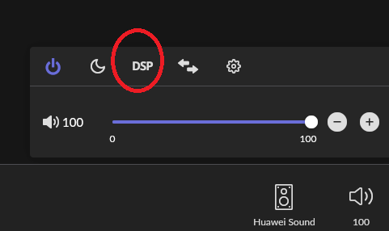

将Roon引入我的听音系统的一些经验

<!-- @import "[TOC]" {cmd="toc" depthFrom=1 depthTo=6 orderedList=false} -->

<!-- code_chunk_output -->

- [系统迁移](#系统迁移)
  - [我之前听音系统的网络拓扑](#我之前听音系统的网络拓扑)
  - [引入Roon后听音系统网络拓扑](#引入roon后听音系统网络拓扑)
- [如何为Roon增加DLNA输出](#如何为roon增加dlna输出)
  - [安装](#安装)
  - [DLNA设备发现](#dlna设备发现)
  - [运行](#运行)
  - [Roon配置](#roon配置)
  - [最终效果](#最终效果)
- [通过VPN实现远程ROON](#通过vpn实现远程roon)
  - [打通WAN连接服务器](#打通wan连接服务器)
  - [搭建VPN服务器](#搭建vpn服务器)
  - [远程机器连接VPN服务器](#远程机器连接vpn服务器)

<!-- /code_chunk_output -->

# 系统迁移

我对之前的听音系统还是比较满意的，我并不是发烧友，当系统的音质能达到一定程度，剩下的就是音乐欣赏的事情了。
这个系统我用了很多年，也没打算做什么调整。
试用了Roon后，我比较喜欢她的和音乐管理，关联，搜索，流媒体音乐深度集成等特性，就购买了帐号，正式将Roon引入了我的听音系统，并归一化了所有的终端。

## 我之前听音系统的网络拓扑

我之前的听音系统终端并没有归一，音频的流动主要以DLNA为主，因为解码器的Bridge卡作为Render，内部通过I2S输入解码板，效果非常好，我又不想折腾各种USB,同轴，光纤的连接，线材不菲且完全不在我的知识范围内。

群晖NAS作为Media Server， 解码器，Mac软件，智能音箱作为Render，电脑、手机和Pad的软件作为Browser和Controller

``` plantuml

node "PS Audio PWD\n(解码器\n24/192)" as dac {
    component "Network Bridge\n(Media Render)" as bridge
    component "解码板" as bdac
    bridge --> bdac : I2S
}

node "Krell S550i\n(功放)" as amp
bdac --> amp : XLR(平衡输出)

node "ATC SCM 19\n(音箱）" as speaker
amp --> speaker

node "群晖NAS\n(J1900四核/8G内存,\n4*4T Raid5阵列)" as nas {
    component "Audio Station\n(Media Server)" as mserver
    mserver -> bridge : DLNA (24/192)\n有线
    component "WebDav Server" as wserver
    wserver -[hidden]r-> mserver
    database "Storage" as storage
    wserver <--> storage : 读写数据
    mserver --> storage : 读写数据
}

node "客厅PC" as pc {
    component "Foobar 2000\n(Brower and Controller)" as f2_1
    f2_1 <--> mserver : DLNA（有线)
}

node "书房MAC" as mac {
    component "Kodi\n(Media Render, \nBrowser and Controller)" as kodi
    kodi <--> mserver : 控制, 获取音频（无线)\nDLNA (32/384, DSD256)
}

node "NuPrime id-8" as dac1
kodi -u=> dac1 : USB <-> DAC
node "丹拿52SE" as speaker1
dac1 -> speaker1 

node "家庭局域网手机/Pad" as phone {
    component "DLNA客户端\n(Brower and Controller)" as dc_1
    dc_1 <--> mserver : 控制(无线)
}

node "小朋友房间\n Huawei Sound X" as soundx
mserver <-u-> soundx : DLNA\n(24/96)\n (无线)

node "卧室一对\n Huawei Sound X" as soundx1
mserver <--> soundx1 : DLNA\n(24/96)\n (无线)

cloud "广域网" as wan
wserver <-l-> wan

node "远程PC" as rpc {
    component "RaiDrive\n (WebDav Client)" as rai
    rai <-u-> wan
    component "Foobar 2000\n(Brower and Controller)" as f2_2
    f2_2 -u-> rai : 读取音频数据
}

node "海贝R6Pro\n(DSD256,\n 32/384,\n MQA)" as hiby
f2_2 <--> hiby : USB <-> DAC

node "远程手机" as rphone {
    component "海贝音乐\n（自带WebDav Client)" as mhiby
    mhiby <-u-> wan : 转发
}

```


## 引入Roon后听音系统网络拓扑

Roon的帐号挺贵的，加上我对原来的硬件还算满意，所以想最大限度的利用，思想就是用Roon Core管理音乐，同时将Roon的RAAT协议都转为DLNA，复用现有的设备。 电脑、手机、平板的客户端都统一到Roon Remote。

感谢philippe开发的SqueezeBox桥接到Upnp的软件squeeze2upnp，使得我复用原有DLNA系统的想法成为了可能，而且他对待用户的反馈是否友好，耐心解答并能很快做出修改。

``` plantuml

node "PS Audio PWD\n(解码器\n24/192)" as dac {
    component "Network Bridge" as bridge
    component "解码板" as bdac
    bridge --> bdac : I2S
}

node "Krell S550i\n(功放)" as amp
bdac --> amp : XLR(平衡输出)

node "ATC SCM 19\n(音箱）" as speaker
amp --> speaker

node "群晖NAS\n(J1900四核/8G内存,\n4*4T Raid5阵列)" as nas {
    component "Roon Server" as roon
    component "squeeze2upnp" as s2u
    roon --> s2u : squeezebox协议
    s2u --> bridge : DLNA (24/192)\n有线
    component "L2TP/IPSec Server" as svpn
    roon <--> svpn : 转发
}

node "客厅PC" as pc {
    component "Roon APP" as roon3
    roon3 <--> roon : 控制（有线)
}

node "书房MAC" as mac {
    component "Roon APP" as roon5
    roon5 <--> roon : 控制（无线)
}

node "NuPrime id-8" as dac1
roon5 -u=> dac1 : USB <-> DAC
node "丹拿52SE" as speaker1
dac1 -> speaker1 

node "家庭局域网手机/Pad" as phone {
    component "Roon APP" as roon4
    roon4 <--> roon : 控制(无线)
}

node "小朋友房间\n Huawei Sound X" as soundx
s2u <--> soundx : DLNA\n(24/96)\n (无线)

node "卧室一对\n Huawei Sound X" as soundx1
s2u <--> soundx1 : DLNA\n(24/96)\n (无线)

cloud "广域网" as wan
svpn <--> wan

node "远程PC" as rpc {
    component "VPN Client" as cvpn1
    cvpn1 <-u-> wan
    component "Roon" as roon1
    cvpn1 <--> roon1 : 转发
}

node "海贝R6Pro\n(DSD256,\n 32/384,\n MQA)" as hiby
roon1 <--> hiby : USB <-> DAC

node "远程手机" as rphone {
    component "VPN Client" as cvpn2
    cvpn2 <-u-> wan
    component "Roon Remote" as roon2
    cvpn2 <--> roon2 : 转发
}

```

# 如何为Roon增加DLNA输出

Roon本身不支持输出，但是支持Squeezebox设备（就是LMS（Logitech Media Server）体系）

下图就是在Roon设置中打开对squeezbox的支持。


接下来的思路就是做一个桥，将Roon使用Squeezebox协议输出的音频转成DLNA的协议

使用这个软件实现：Squeeze2upnp，他的目的就是将DLNA设备变成SqueezeBox设备

``` plantuml
node "Roon Remote" as remote
node "Roon Core" as core
node "Squeeze2upnp\n(pass through or resample)" as s2u
node "DLNA render\n(eg. Huawei Sound X) " as render

remote --> core : play control
core -> s2u
s2u -> render : DLNA protocol
```

软件github地址：https://github.com/philippe44/LMS-to-uPnP
里面有下载地址和提供支持的论坛地址

## 安装

安装非常简单，从github网址给出的下载网站下载最新的安装包解压即可。

！！！重要，需要安装1.49.8之后的版本，这之前的版本不支持Huawei Sound，我和作者squeeze2upnp的作者philippe反馈后并提供日志后，他经过修改，新出了版本用于支持Huawei Sound

安装包解压后有一个Bin目录，所有平台的可执行文件都在里面。
```bash
ls ./Bin
cc32160mt.dll  libmad-0.dll   libopusfile-0.dll  pthreadBC2.dll               squeeze2upnp-armv5te-static  squeeze2upnp-bsd-x64-static    squeeze2upnp-ppc-static    squeeze2upnp-x86            ssleay32.dll
libeay32.dll   libogg-0.dll   libsoxr.dll        squeeze2upnp-aarch64         squeeze2upnp-armv6hf         squeeze2upnp-osx-multi         squeeze2upnp-sparc         squeeze2upnp-x86-64
libfaad2.dll   libogg.dll     libvorbis.dll      squeeze2upnp-aarch64-static  squeeze2upnp-armv6hf-static  squeeze2upnp-osx-multi-static  squeeze2upnp-sparc-static  squeeze2upnp-x86-64-static
libFLAC.dll    libopus-0.dll  libvorbisfile.dll  squeeze2upnp-armv5te         squeeze2upnp-bsd-x64         squeeze2upnp-ppc               squeeze2upnp-win.exe       squeeze2upnp-x86-static
```

尽管Squeeze2upnp是LMS的一个插件，但是他并不依赖LMS，可以独立运行。解压后在Bin目录下后缀为_static的可执行程序都是独立执行程序

Squeeze2upnp支持Windows, OSX, or Linux x86/64, ARM and OSX

可以从可执行的程序名中看出哪个可执行程序对应什么平台。

例如树莓派，你可以选择 ： squeeze2upnp-armv6hf-static
例如群晖X86 NAS， 你可以选择 ： squeeze2upnp-x86-64-static

对于Linux，对应你平台的执行文件需要增加可执行属性，例如
``` bash
chomd a+x squeeze2upnp-x86-64-static
```

以下描述以都以群晖NAS为例，其他的平台将命令中的可执行程序替换为对应平台的执行程序即可。

## DLNA设备发现

对于第一次使用，或者希望重新创建一个配置文件，需要执行以下命令:
``` bash
./Bin/squeeze2upnp-x86-64-static -i config.xml
[22:18:38.897023] main:1756 Starting squeeze2upnp version: v1.49.6 (Feb 13 2021 @ 14:45:36)
[22:18:38.904985] main:1764

!!!!!!!!!!!!!!!!!! ERROR LOADING CONFIG FILE !!!!!!!!!!!!!!!!!!!!!

[22:18:38.943266] Start:1518 Binding to 192.168.1.100:49152 (http:0)
[22:18:39.363148] AddMRDevice:1405 [0xc41840]: adding renderer (HUAWEI Sound-0286)
[22:18:39.363354] AddMRDevice:1418 [0xc41840]: cannot get mac HUAWEI Sound-0286, creating fake fcceaf23
[22:18:39.371278] MasterHandler:1036 [0xc41840]: subscribe success
[22:18:39.395668] AddMRDevice:1405 [0xc43a58]: adding renderer (LIVINGROOM)
[22:18:39.395813] AddMRDevice:1418 [0xc43a58]: cannot get mac LIVINGROOM, creating fake 13a64ae6
[22:18:39.428824] MasterHandler:1036 [0xc43a58]: subscribe success
[22:19:00.344578] Stop:1540 stopping squeezelite devices ...
[22:19:00.344673] Stop:1544 terminate update thread ...
[22:19:00.344770] Stop:1549 terminate main thread ...
[22:19:00.344824] Stop:1553 stopping UPnP devices ...

```

等程序执行完，就会生成一个基础配置文件（config.xml，这个名字可以按照你的指定更换），里面包括默认配置和发现的你的局域网的DLNA设备。 
注：你的DLNA Render设备需要打开才能被发现并生成配置。

其中<common>...</common>段是针对你所有设备的通用配置

每个发现的设备都有一个<device>...</device>段，你可以在<device>段中设置和common中相同的参数，这个参数会针对这个设备覆盖common参数。

以我的设备为例，生成的设备配置如下:
```xml
<device>
    <udn>uuid:b8aabe2db4df5481eb8b4f4cf3f302eac9a1539192127404166af840a41a0945</udn>
    <name>HUAWEI Sound-0286</name>
    <friendly_name>HUAWEI Sound-0286</friendly_name>
    <mac>bb:bb:23:af:ce:fc</mac>
    <enabled>1</enabled>
</device>
<device>
    <udn>uuid:9166ce01-e4b5-4d56-8a1a-6a031b3b416b</udn>
    <name>LIVINGROOM</name>
    <friendly_name>LIVINGROOM</friendly_name>
    <mac>bb:bb:e6:4a:a6:13</mac>
    <enabled>1</enabled>
</device>
```
其中LIVINGROOM是我客厅的PS Audio PWD解码器，而HUAWEI Sound-0286则是卧室的Huawei智能音箱

接下来要对config.xml做一些简单的配置修改。例如, 在"common"段设置了设备最大支持48Khz采样率， 但是如果你的设备的最大采样率是192Khz，你可以在"device"段进行覆盖:
``` xml
<common>
  ...
  <sample_rate>48000</sample_rate>
  ...
</common>
<device>
  ...
  <sample_rate>192000</sample_rate>
  ...
</device>
```
尽管根据测试华为智能音箱支持24bit/192Khz，但是华为给出的规格是24bit/96Khz，所以建议还是把Huawei Sound的采样率设置为96Khz

每个被发现的设备的"enable"属性都是1，表示会为这个设备生成一个桥设备，在Roon设置里面的音频设备列表展现， 如果你不想在Roon中使用这个设备，就将enable设置为0.

"device"段里面有一个有个属性是DLNA Render的标识，类似:
```xml
<mac>bb:bb:e6:4a:a6:13</mac>
```
这是这个设备的标识，后续发现设备时，设备mac地址和这个段相同，就不会添加新的设备，并使用这个"device"设置的属性进行处理。

！！！！！！**最重要的一点: 将roon_mode属性设置为1，否则Roon下可能不工作**
```xml
<roon_mode>1</roon_mode>
```

!!!!! **另外重要的一点，需要在Huawei Sound的"device"段中增加以下属性，否则会不能播放下一首，或者播放进度条不走
```xml
<accept_nexturi>1</accept_nexturi>
```

后续有新设备发现，squeeze2upnp会为新设备增加一个device段到配置文件。如果你不想自动增加新设备（可能会造成问题），可以将"common"段的"enabled"属性设置为0

## 运行

测试运行：
```bash
squeeze2upnp-x86-64-static -x config.xml
```
调试信息会输出在终端

正式运行
```bash
./Bin/squeeze2upnp-x86-64-static -z -x config.xml
```
**要用-z参数在后台运行，否则即使使用Linux在后台运行，会占用一个CPU核的全部资源**

然后需要开机启动就将上诉命令加入到/etc/rc.local 中即可

## Roon配置
在Roon的“设置”->"音频"中启用桥设备，并给其命名，例如命名为Huawei Sound


对设备进行一些简单配置


在右下角的设备选择那里选择需要播放的设备，例如Huawei Sound音箱


然后打开设备的DSP选项


将Huawei Sound高于96k码率的音乐和DSD音乐进行转换


## 最终效果

这下，就可以在Roon系统中使用Huawei智能音箱了


# 通过VPN实现远程ROON

## 打通WAN连接服务器

1. 首先要像运营商（如电信宽带）申请公网IP。

2. 申请一个免费域名，同时将域名设置动态映射。这个每家域名提供商具体不一样，根据指导去配。

3. 公网IP一般是动态的，会变化的，使用DDNS来做动态映射，以下以梅林固件的路由器为例：

服务器选择不同域名提供商，然后输入用户名等参数

## 搭建VPN服务器

以群晖NAS为例

1. 安装VPN Server套件


2. 启动L2TP/IPSec服务器

其中10.2.0.0是VPN虚拟机局域网的网段

3. 在路由器做端口映射，将以下端口流量导向NAS
UDP:500
UDP:4500
UDP:1701


或者也可以通过DMZ映射到NAS服务器地址

## 远程机器连接VPN服务器

以在Windows设置创建VPN连接为例

1. 修改注册表并重启
在“Computer\HKEY_LOCAL_MACHINE\SYSTEM\CurrentControlSet\Services\PolicyAgent”创建一个DWORD (32-bit)值，可以是“AssumeUDPEncapsulationContextOnSendRule”， 值为“2”
修改完最好重启

2. 创建连接

其中
a. 用户名和密码是你创建VPN服务器的NAS用户用户名和密码
b. 共享密钥是第2步设置的预共享密钥

3. 进行连接


连接后会增加一个虚拟网卡

```
PPP 适配器 myhome:

   连接特定的 DNS 后缀 . . . . . . . :
   本地链接 IPv6 地址. . . . . . . . : fe80::ecdd:7a2a:228e:9b30%51
   IPv4 地址 . . . . . . . . . . . . : 10.2.0.1
   子网掩码  . . . . . . . . . . . . : 255.255.255.255
   默认网关. . . . . . . . . . . . . : 0.0.0.0
```

同时你也可以访问NAS所在局域网的地址
例如 
``` bash
ping 192.168.1.100
```

此时你的Windows和NAS已经处在一个虚拟局域网下，启动远程计算机上的Roon就可以连接NAS上跑的Core了。

此时你看到Roon Core的IP地址是刚才建立的VPN的网段（Core机器上也有一个虚拟网卡）


同时也可以发现远程Windows机器上连接的音频设备用于播放


