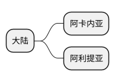
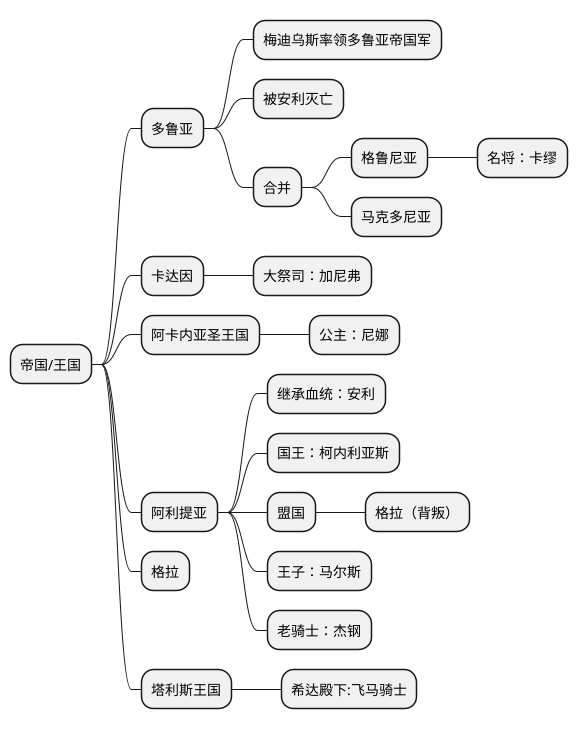
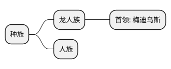

# 大陆

```plantuml
@startmindmap

* 大陆
** 阿卡内亚
** 阿利提亚

@endmindmap
```

# 帝国/王国

```plantuml
@startmindmap

* 帝国/王国
** 多鲁亚
*** 梅迪乌斯率领多鲁亚帝国军
*** 被安利灭亡
*** 合并
**** 格鲁尼亚
***** 名将：卡缪
**** 马克多尼亚
** 卡达因
*** 大祭司：加尼弗
** 阿卡内亚圣王国
*** 公主：尼娜
** 阿利提亚
*** 继承血统：安利
*** 国王：柯内利亚斯
*** 盟国
**** 格拉（背叛）
*** 王子：马尔斯
*** 老骑士：杰钢
** 格拉
** 塔利斯王国
*** 希达殿下:飞马骑士

@endmindmap
```

# 种族

```plantuml
@startmindmap

* 种族
** 龙人族
*** 首领: 梅迪乌斯
** 人族

@endmindmap
```

# 人物

安利 ： 阿利提亚

# 物品

神剑法尔西昂